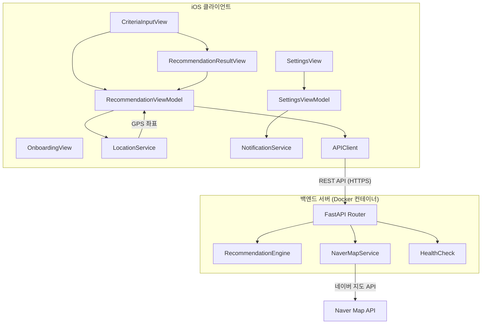
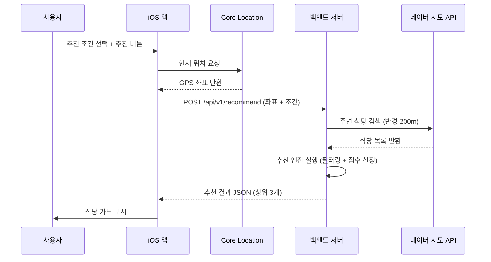

# 기술 설계 문서 (Technical Design Document)

## 개요 (Overview)

점심 메뉴 추천 앱은 클라이언트(iOS) + 백엔드 서버(컨테이너) 구조로 구성된다.

- **iOS 클라이언트**: Swift/SwiftUI 기반. 사용자 인터페이스, GPS 위치 획득, 로컬 알림 등 디바이스 기능을 담당한다.
- **백엔드 서버**: Python(FastAPI) 기반, Docker 컨테이너로 배포. 추천 엔진 로직, 네이버 지도 API 호출 등 핵심 비즈니스 로직을 처리한다.

핵심 흐름:
1. 사용자가 iOS 앱에서 추천 조건(날씨, 기분, 이벤트, 가격대)을 선택
2. Core Location으로 현재 GPS 좌표 획득
3. iOS 앱이 좌표 + 추천 조건을 백엔드 서버 REST API로 전송
4. 백엔드 서버가 네이버 지도 API로 반경 200m 이내 식당 목록 검색
5. 백엔드의 규칙 기반(rule-based) 추천 엔진이 조건에 따라 필터링 및 점수 산정
6. 상위 3개 식당을 JSON 응답으로 반환
7. iOS 앱이 결과를 카드 형태로 표시
8. 로컬 알림으로 매일 지정 시간에 추천 유도

### 기술 스택 결정

| 구분 | 기술 | 버전 | 선택 이유 |
|------|------|------|-----------|
| iOS 클라이언트 | Swift / SwiftUI | Swift 5.9+ / iOS 17+ | 네이티브 성능, Core Location/UNNotification 직접 접근 |
| 백엔드 프레임워크 | Python / FastAPI | Python 3.12, FastAPI 0.115 | 비동기 지원, 자동 API 문서 생성(OpenAPI), 빠른 개발 속도 |
| 컨테이너 | Docker | 최신 안정 버전 | 표준 컨테이너 런타임, 어디서든 동일한 환경 보장 |
| HTTP 클라이언트 (백엔드) | httpx | 0.27+ | FastAPI와 호환되는 비동기 HTTP 클라이언트 |
| HTTP 클라이언트 (iOS) | URLSession | 내장 | iOS 표준 네트워킹 API |

Python/FastAPI를 선택한 이유:
- Node.js 대비 데이터 처리 및 규칙 엔진 로직 작성이 간결
- 타입 힌트(type hints)를 통한 Pydantic 모델 자동 검증
- FastAPI의 자동 OpenAPI 문서 생성으로 iOS 개발자와의 협업 용이
- 안정된 최신 버전인 Python 3.12 사용

## 아키텍처 (Architecture)

시스템은 iOS 클라이언트와 Docker 컨테이너 기반 백엔드 서버로 구성된 클라이언트-서버 아키텍처를 따른다.



### 통신 흐름



### 레이어 구조

#### iOS 클라이언트

| 레이어 | 역할 | 주요 컴포넌트 |
|--------|------|---------------|
| View | UI 표시 및 사용자 입력 | CriteriaInputView, RecommendationResultView, SettingsView, OnboardingView |
| ViewModel | 상태 관리, API 호출 조율 | RecommendationViewModel, SettingsViewModel |
| Service | 디바이스 기능, 네트워크 통신 | LocationService, NotificationService, APIClient |
| Model | 데이터 구조 정의 | RecommendationCriteria, RecommendationResponse 등 |

#### 백엔드 서버

| 레이어 | 역할 | 주요 컴포넌트 |
|--------|------|---------------|
| Router | API 엔드포인트 정의, 요청/응답 처리 | recommend_router, health_router |
| Service | 비즈니스 로직 | RecommendationEngine, NaverMapService |
| Model | 데이터 구조 (Pydantic) | RecommendationRequest, RecommendationResponse, Restaurant 등 |
| Config | 설정 관리 | 환경 변수, API 키 관리 |

## 컴포넌트 및 인터페이스 (Components and Interfaces)

### 백엔드 서버 컴포넌트

#### 1. REST API 엔드포인트

```
POST /api/v1/recommend     - 추천 요청
GET  /api/v1/health        - 헬스체크
```

##### POST /api/v1/recommend

요청(Request):
```json
{
  "latitude": 37.5665,
  "longitude": 126.9780,
  "weather": "rainy",
  "mood": "sad",
  "event": "none",
  "price_range": "medium",
  "exclude_ids": ["restaurant_001", "restaurant_002"]
}
```

응답(Response):
```json
{
  "recommendations": [
    {
      "id": "restaurant_003",
      "name": "김치찌개 명가",
      "category": "한식",
      "address": "서울시 중구 ...",
      "latitude": 37.5668,
      "longitude": 126.9782,
      "distance": 45,
      "price_range": "medium",
      "naver_map_url": "https://map.naver.com/...",
      "score": 0.87
    }
  ],
  "total_searched": 15,
  "total_matched": 5
}
```

##### GET /api/v1/health

응답(Response):
```json
{
  "status": "healthy",
  "version": "1.0.0"
}
```

#### 2. NaverMapService (백엔드)

네이버 지도 API를 호출하여 주변 식당을 검색하는 서비스.

```python
# 네이버 지도 서비스
class NaverMapService:
    """네이버 지도 API를 통해 주변 식당을 검색하는 서비스"""

    async def search_nearby_restaurants(
        self,
        latitude: float,
        longitude: float,
        radius_meters: int = 200
    ) -> list[Restaurant]:
        """주어진 좌표 반경 내 식당 목록 검색"""
        ...
```

- 네이버 지도 API의 `/v1/search/local` 엔드포인트 사용
- 반경 200m 고정
- API 키는 환경 변수(`NAVER_CLIENT_ID`, `NAVER_CLIENT_SECRET`)에서 로드
- 네트워크 실패 시 `SearchError` 예외 발생

#### 3. RecommendationEngine (백엔드)

규칙 기반으로 식당을 필터링하고 점수를 매기는 핵심 모듈.

```python
# 추천 엔진
class RecommendationEngine:
    """규칙 기반 식당 추천 엔진"""

    def recommend(
        self,
        restaurants: list[Restaurant],
        criteria: RecommendationCriteria,
        exclude_ids: set[str] | None = None,
        top_n: int = 3
    ) -> list[ScoredRestaurant]:
        """조건에 따라 식당을 필터링하고 점수를 매겨 상위 N개 반환"""
        ...
```

##### 점수 산정 규칙

각 조건별로 가중치를 부여하여 총점을 계산한다.

| 조건 | 가중치 | 점수 산정 방식 |
|------|--------|----------------|
| 가격대 | 40% | 사용자 선택 가격대와 식당 가격대 일치 시 1.0, 불일치 시 0.0 |
| 카테고리 적합도 | 30% | 날씨+기분+이벤트 조합에 따른 카테고리 매핑 테이블 기반 점수 (0.0~1.0) |
| 거리 | 20% | 가까울수록 높은 점수. `1.0 - (distance / max_radius)` |
| 랜덤 보정 | 10% | 매번 같은 결과 방지를 위한 랜덤 값 (0.0~1.0) |

**총점 = (가격대 점수 × 0.4) + (카테고리 적합도 × 0.3) + (거리 점수 × 0.2) + (랜덤 보정 × 0.1)**

##### 카테고리 매핑 테이블 (예시)

| 날씨 | 기분 | 이벤트 | 추천 카테고리 |
|------|------|--------|---------------|
| 비 | 우울 | 없음 | 탕/찌개, 라멘 |
| 맑음 | 기쁨 | 데이트 | 양식, 일식 |
| 눈 | 피곤 | 혼밥 | 국밥, 분식 |
| 흐림 | 보통 | 회식 | 고기, 중식 |
| * | * | 다이어트 | 샐러드, 포케 |

전체 조합은 백엔드 서버 내부에 딕셔너리(dict)로 정의하며, 매핑되지 않는 조합은 모든 카테고리에 동일 점수를 부여한다.

### iOS 클라이언트 컴포넌트

#### 4. APIClient (iOS)

백엔드 서버와 REST API로 통신하는 모듈.

```swift
// API 클라이언트 프로토콜
protocol APIClientProtocol {
    /// 백엔드 서버에 추천 요청
    func requestRecommendation(
        coordinate: Coordinate,
        criteria: RecommendationCriteria,
        excludeIds: Set<String>
    ) async throws -> RecommendationResponse

    /// 서버 헬스체크
    func healthCheck() async throws -> Bool
}
```

- `URLSession` 기반 비동기 네트워크 통신
- 서버 URL은 앱 설정(Configuration)에서 관리
- JSON 인코딩/디코딩에 `Codable` 프로토콜 사용
- 서버 무응답 시 `APIError.serverUnavailable` 에러 throw
- 타임아웃: 10초

#### 5. LocationService (iOS)

GPS 좌표를 획득하는 서비스. Core Location 프레임워크를 래핑한다.

```swift
// 위치 서비스 프로토콜
protocol LocationServiceProtocol {
    /// 현재 GPS 좌표를 비동기로 반환
    func getCurrentLocation() async throws -> Coordinate
}
```

- `CLLocationManager`를 내부적으로 사용
- 권한 상태 확인 및 요청 처리
- 권한 거부 시 `LocationError.permissionDenied` 에러 throw

#### 6. NotificationService (iOS)

로컬 알림 예약 및 관리 서비스.

```swift
// 알림 서비스 프로토콜
protocol NotificationServiceProtocol {
    /// 매일 반복 알림 예약
    func scheduleDailyNotification(at hour: Int, minute: Int) async throws
    /// 예약된 알림 모두 취소
    func cancelAllNotifications()
    /// 알림 권한 요청
    func requestPermission() async throws -> Bool
}
```

- `UNUserNotificationCenter` 사용
- 알림 식별자: `"lunch-menu-daily-reminder"`
- 알림 내용: "점심 뭐 먹지? 지금 추천받아 보세요!"
- 알림 탭 시 앱의 추천 조건 입력 화면으로 딥링크

### 7. View 컴포넌트 (iOS)

#### CriteriaInputView
- 날씨, 기분, 이벤트, 가격대 선택 UI (각각 세그먼트 컨트롤 또는 버튼 그리드)
- 미선택 항목 강조 표시 (빨간 테두리)
- "추천받기" 버튼

#### RecommendationResultView
- 추천 식당 3곳을 카드 형태로 표시
- 각 카드: 식당 이름, 카테고리, 거리(m), 가격대
- 카드 탭 시 네이버 지도 앱/웹으로 이동
- "다시 추천받기" 버튼

#### SettingsView
- 알림 시간 설정 (DatePicker, 시/분)
- 알림 활성화/비활성화 토글

#### OnboardingView
- 최초 실행 시 권한 안내 및 요청 화면
- 위치 권한 → 알림 권한 순서로 요청

### 8. ViewModel 컴포넌트 (iOS)

#### RecommendationViewModel

```swift
@MainActor
class RecommendationViewModel: ObservableObject {
    @Published var weather: Weather?
    @Published var mood: Mood?
    @Published var event: Event?
    @Published var priceRange: PriceRange?
    @Published var recommendations: [ScoredRestaurant] = []
    @Published var errorMessage: String?
    @Published var isLoading: Bool = false
    @Published var validationErrors: Set<CriteriaField> = []

    private var previousRecommendationIds: Set<String> = []

    /// 모든 조건이 선택되었는지 검증
    func validateCriteria() -> Bool

    /// 추천 실행: 위치 획득 → API 호출 → 결과 표시
    func requestRecommendation() async

    /// 다시 추천: 이전 추천 식당 ID를 exclude_ids로 전달
    func requestNewRecommendation() async
}
```

#### SettingsViewModel

```swift
@MainActor
class SettingsViewModel: ObservableObject {
    @Published var notificationHour: Int = 11
    @Published var notificationMinute: Int = 30
    @Published var isNotificationEnabled: Bool = false

    /// 알림 설정 저장 및 예약
    func saveNotificationSettings() async

    /// 알림 비활성화 및 취소
    func disableNotification()
}
```

### 9. Docker 컨테이너 구성

```dockerfile
FROM python:3.12-slim

WORKDIR /app

COPY requirements.txt .
RUN pip install --no-cache-dir -r requirements.txt

COPY . .

EXPOSE 8000

# 헬스체크 설정
HEALTHCHECK --interval=30s --timeout=5s --retries=3 \
    CMD curl -f http://localhost:8000/api/v1/health || exit 1

CMD ["uvicorn", "app.main:app", "--host", "0.0.0.0", "--port", "8000"]
```

환경 변수:
- `NAVER_CLIENT_ID`: 네이버 지도 API 클라이언트 ID
- `NAVER_CLIENT_SECRET`: 네이버 지도 API 클라이언트 시크릿
- `LOG_LEVEL`: 로깅 레벨 (기본값: `INFO`)

## 데이터 모델 (Data Models)

### 백엔드 모델 (Pydantic)

```python
from enum import Enum
from pydantic import BaseModel

# 날씨 선택지
class Weather(str, Enum):
    SUNNY = "sunny"      # 맑음
    CLOUDY = "cloudy"    # 흐림
    RAINY = "rainy"      # 비
    SNOWY = "snowy"      # 눈

# 기분 선택지
class Mood(str, Enum):
    HAPPY = "happy"      # 기쁨
    NORMAL = "normal"    # 보통
    SAD = "sad"          # 우울
    TIRED = "tired"      # 피곤

# 이벤트 선택지
class Event(str, Enum):
    TEAM_DINNER = "team_dinner"  # 회식
    DATE = "date"                # 데이트
    SOLO = "solo"                # 혼밥
    DIET = "diet"                # 다이어트
    NONE = "none"                # 없음

# 가격대 선택지
class PriceRange(str, Enum):
    LOW = "low"          # 저가 (1만원 미만)
    MEDIUM = "medium"    # 중가 (1만원~2만원)
    HIGH = "high"        # 고가 (2만원 초과)

# 추천 요청
class RecommendationRequest(BaseModel):
    latitude: float
    longitude: float
    weather: Weather
    mood: Mood
    event: Event
    price_range: PriceRange
    exclude_ids: list[str] = []

# 식당 정보
class Restaurant(BaseModel):
    id: str
    name: str
    category: str
    address: str
    latitude: float
    longitude: float
    distance: int          # 미터 단위
    price_range: PriceRange
    naver_map_url: str

# 점수가 매겨진 식당
class ScoredRestaurant(BaseModel):
    id: str
    name: str
    category: str
    address: str
    latitude: float
    longitude: float
    distance: int
    price_range: PriceRange
    naver_map_url: str
    score: float

# 추천 응답
class RecommendationResponse(BaseModel):
    recommendations: list[ScoredRestaurant]
    total_searched: int
    total_matched: int

# 헬스체크 응답
class HealthResponse(BaseModel):
    status: str
    version: str
```

### iOS 모델 (Swift)

#### 열거형 (Enums)

```swift
// 날씨 선택지
enum Weather: String, CaseIterable, Codable {
    case sunny, cloudy, rainy, snowy

    var displayName: String {
        switch self {
        case .sunny: return "맑음"
        case .cloudy: return "흐림"
        case .rainy: return "비"
        case .snowy: return "눈"
        }
    }
}

// 기분 선택지
enum Mood: String, CaseIterable, Codable {
    case happy, normal, sad, tired

    var displayName: String {
        switch self {
        case .happy: return "기쁨"
        case .normal: return "보통"
        case .sad: return "우울"
        case .tired: return "피곤"
        }
    }
}

// 이벤트 선택지
enum Event: String, CaseIterable, Codable {
    case teamDinner = "team_dinner"
    case date, solo, diet, none

    var displayName: String {
        switch self {
        case .teamDinner: return "회식"
        case .date: return "데이트"
        case .solo: return "혼밥"
        case .diet: return "다이어트"
        case .none: return "없음"
        }
    }
}

// 가격대 선택지
enum PriceRange: String, CaseIterable, Codable {
    case low, medium, high

    var displayName: String {
        switch self {
        case .low: return "저가"
        case .medium: return "중가"
        case .high: return "고가"
        }
    }
}

// 검증 실패 필드 식별
enum CriteriaField: String, CaseIterable {
    case weather, mood, event, priceRange
}
```

#### 구조체 (Structs)

```swift
// GPS 좌표
struct Coordinate: Equatable, Codable {
    let latitude: Double
    let longitude: Double
}

// 추천 요청 (서버 전송용)
struct RecommendationRequest: Codable {
    let latitude: Double
    let longitude: Double
    let weather: Weather
    let mood: Mood
    let event: Event
    let priceRange: PriceRange
    let excludeIds: [String]

    enum CodingKeys: String, CodingKey {
        case latitude, longitude, weather, mood, event
        case priceRange = "price_range"
        case excludeIds = "exclude_ids"
    }
}

// 추천 조건 (앱 내부용)
struct RecommendationCriteria: Equatable {
    let weather: Weather
    let mood: Mood
    let event: Event
    let priceRange: PriceRange
}

// 점수가 매겨진 식당 (서버 응답)
struct ScoredRestaurant: Identifiable, Codable, Equatable {
    let id: String
    let name: String
    let category: String
    let address: String
    let latitude: Double
    let longitude: Double
    let distance: Int
    let priceRange: PriceRange
    let naverMapUrl: String
    let score: Double

    enum CodingKeys: String, CodingKey {
        case id, name, category, address, latitude, longitude, distance, score
        case priceRange = "price_range"
        case naverMapUrl = "naver_map_url"
    }
}

// 추천 응답
struct RecommendationResponse: Codable {
    let recommendations: [ScoredRestaurant]
    let totalSearched: Int
    let totalMatched: Int

    enum CodingKeys: String, CodingKey {
        case recommendations
        case totalSearched = "total_searched"
        case totalMatched = "total_matched"
    }
}
```

#### 에러 타입

```swift
// 위치 서비스 에러
enum LocationError: Error, Equatable {
    case permissionDenied
    case permissionNotDetermined
    case locationUnavailable
}

// API 통신 에러
enum APIError: Error, Equatable {
    case serverUnavailable
    case invalidResponse
    case networkFailure
    case noResults
}

// 알림 서비스 에러
enum NotificationError: Error, Equatable {
    case permissionDenied
    case schedulingFailed
}
```

## 정확성 속성 (Correctness Properties)

*정확성 속성(property)이란 시스템의 모든 유효한 실행에서 참이어야 하는 특성 또는 동작이다. 사람이 읽을 수 있는 명세와 기계가 검증할 수 있는 정확성 보장 사이의 다리 역할을 한다.*

### Property 1: 불완전한 조건 입력 시 검증 실패

*For any* 추천 조건 조합에서 하나 이상의 필드가 nil인 경우, 검증 함수는 false를 반환하고, validationErrors 집합에는 정확히 nil인 필드들만 포함되어야 한다.

**Validates: Requirements 1.7**

### Property 2: 유효한 조건이 올바른 요청으로 구성됨

*For any* 모든 필드가 선택된 유효한 추천 조건 조합과 임의의 GPS 좌표에 대해, 생성된 RecommendationRequest의 각 필드 값은 사용자가 선택한 조건 및 좌표와 정확히 일치해야 한다.

**Validates: Requirements 1.6**

### Property 3: 검색 반경 200m 고정

*For any* 유효한 GPS 좌표에 대해, NaverMapService가 네이버 지도 API를 호출할 때 반경 파라미터는 항상 200(미터)이어야 한다.

**Validates: Requirements 2.2**

### Property 4: 추천 결과 정렬 및 개수 제한

*For any* 식당 목록과 추천 조건에 대해, 추천 엔진이 반환하는 결과는 (1) 점수 내림차순으로 정렬되어 있고, (2) 최대 3개이며, (3) 각 식당에 0.0 이상의 점수가 부여되어 있어야 한다.

**Validates: Requirements 3.1, 3.2**

### Property 5: 추천 결과 필수 정보 포함

*For any* 추천된 식당에 대해, 해당 식당의 데이터에는 이름(name), 카테고리(category), 거리(distance), 가격대(price_range) 정보가 모두 비어있지 않은 값으로 포함되어야 한다.

**Validates: Requirements 3.3, 5.2**

### Property 6: 이전 추천 제외

*For any* 식당 목록과 제외 ID 집합에 대해, 제외 ID에 해당하지 않는 식당이 충분히 존재할 때(3개 이상), 추천 엔진의 반환 결과에는 제외 ID에 해당하는 식당이 포함되지 않아야 한다.

**Validates: Requirements 3.6**

### Property 7: 알림 예약 유효성

*For any* 유효한 시간(hour: 0~23, minute: 0~59)에 대해, 알림 예약 함수 호출 후 시스템에 등록된 알림의 트리거 시간은 요청한 시간과 일치해야 한다.

**Validates: Requirements 4.2**

### Property 8: API 키 비노출

*For any* 유효한 추천 요청에 대해, 백엔드 서버의 응답 JSON에는 네이버 지도 API 클라이언트 ID 또는 시크릿 값이 포함되지 않아야 한다.

**Validates: Requirements 7.4**

### Property 9: 요청/응답 직렬화 라운드트립

*For any* 유효한 RecommendationRequest 객체에 대해, JSON으로 직렬화한 후 다시 역직렬화하면 원래 객체와 동일한 값을 가져야 한다. RecommendationResponse에 대해서도 동일하게 성립해야 한다.

**Validates: Requirements 7.2, 7.3**

## 에러 처리 (Error Handling)

### iOS 클라이언트 에러 처리

| 에러 상황 | 에러 타입 | 사용자 메시지 | 처리 방식 |
|-----------|-----------|---------------|-----------|
| 위치 권한 거부 | `LocationError.permissionDenied` | "위치 권한이 필요합니다. 설정에서 권한을 허용해주세요." | 설정 앱으로 이동 버튼 제공 |
| 위치 획득 실패 | `LocationError.locationUnavailable` | "현재 위치를 확인할 수 없습니다." | 재시도 버튼 제공 |
| 서버 무응답 | `APIError.serverUnavailable` | "서버에 연결할 수 없습니다. 잠시 후 다시 시도해주세요." | 재시도 버튼 제공, 타임아웃 10초 |
| 네트워크 실패 | `APIError.networkFailure` | "식당 검색에 실패했습니다. 네트워크 연결을 확인해주세요." | 재시도 버튼 제공 |
| 잘못된 응답 | `APIError.invalidResponse` | "서버 응답을 처리할 수 없습니다." | 재시도 버튼 제공 |
| 검색 결과 없음 | `APIError.noResults` | "주변에 검색된 식당이 없습니다." | 조건 변경 안내 |
| 알림 권한 거부 | `NotificationError.permissionDenied` | "알림 권한이 필요합니다. 설정에서 권한을 허용해주세요." | 설정 앱으로 이동 버튼 제공 |

### 백엔드 서버 에러 처리

| 에러 상황 | HTTP 상태 코드 | 응답 형식 | 처리 방식 |
|-----------|---------------|-----------|-----------|
| 잘못된 요청 파라미터 | 422 Unprocessable Entity | `{"detail": "검증 오류 상세"}` | FastAPI/Pydantic 자동 검증 |
| 네이버 지도 API 실패 | 502 Bad Gateway | `{"detail": "외부 API 호출 실패"}` | 에러 로깅 후 클라이언트에 전달 |
| 네이버 지도 API 타임아웃 | 504 Gateway Timeout | `{"detail": "외부 API 응답 시간 초과"}` | 5초 타임아웃, 에러 로깅 |
| 검색 결과 없음 | 200 OK | `{"recommendations": [], ...}` | 빈 배열 반환 (정상 응답) |
| 서버 내부 오류 | 500 Internal Server Error | `{"detail": "내부 서버 오류"}` | 에러 로깅, 스택 트레이스 기록 |

### 로깅 전략

- 모든 요청/응답을 구조화된 JSON 형식으로 로깅
- 로그 레벨: `LOG_LEVEL` 환경 변수로 제어 (기본값: `INFO`)
- 네이버 지도 API 호출 시 요청 URL과 응답 상태 코드 로깅
- 에러 발생 시 스택 트레이스 포함하여 `ERROR` 레벨로 로깅
- API 키 등 민감 정보는 로그에서 마스킹 처리

## 테스트 전략 (Testing Strategy)

### 테스트 접근 방식

단위 테스트(unit test)와 속성 기반 테스트(property-based test)를 병행하여 포괄적인 테스트 커버리지를 확보한다.

- **단위 테스트**: 특정 예시, 엣지 케이스, 에러 조건 검증
- **속성 기반 테스트**: 모든 유효한 입력에 대해 보편적 속성 검증
- 두 방식은 상호 보완적이며, 단위 테스트는 구체적 버그를, 속성 테스트는 일반적 정확성을 검증한다

### 속성 기반 테스트 설정

| 구분 | iOS (Swift) | 백엔드 (Python) |
|------|-------------|-----------------|
| 라이브러리 | SwiftCheck | Hypothesis |
| 최소 반복 횟수 | 100회 | 100회 |
| 태그 형식 | `// Feature: lunch-menu-recommender, Property N: ...` | `# Feature: lunch-menu-recommender, Property N: ...` |

각 정확성 속성은 반드시 하나의 속성 기반 테스트로 구현되어야 한다.

### 백엔드 테스트 (Python / Hypothesis)

#### 속성 기반 테스트

- **Property 3 (검색 반경 200m 고정)**: NaverMapService의 API 호출 파라미터 검증
- **Property 4 (추천 결과 정렬/개수/점수)**: RecommendationEngine.recommend()에 임의의 식당 목록과 조건을 입력하여 결과 검증
- **Property 5 (필수 정보 포함)**: 임의의 추천 결과에 대해 필수 필드 존재 확인
- **Property 6 (이전 추천 제외)**: exclude_ids 파라미터가 올바르게 동작하는지 검증
- **Property 8 (API 키 비노출)**: 임의의 요청에 대한 응답 JSON에서 API 키 문자열 부재 확인
- **Property 9 (직렬화 라운드트립)**: Pydantic 모델의 JSON 직렬화/역직렬화 라운드트립 검증

#### 단위 테스트

- 카테고리 매핑 테이블의 특정 조합 검증 (비+우울+없음 → 탕/찌개, 라멘)
- 빈 식당 목록 입력 시 빈 결과 반환 (엣지 케이스 3.5)
- 3곳 미만 매칭 시 있는 만큼만 반환 (엣지 케이스 3.4)
- 네이버 지도 API 실패 시 적절한 에러 응답 (2.5)
- 헬스체크 엔드포인트 응답 형식 검증 (7.5)
- 잘못된 요청 파라미터에 대한 422 응답 검증
- 요청/응답 로깅 동작 확인 (7.7)

### iOS 테스트 (Swift / SwiftCheck)

#### 속성 기반 테스트

- **Property 1 (불완전한 조건 검증)**: 임의의 nil 조합에 대해 validateCriteria() 동작 검증
- **Property 2 (유효한 조건 → 올바른 요청)**: 임의의 유효한 조건에 대해 RecommendationRequest 생성 검증
- **Property 7 (알림 예약 유효성)**: 임의의 유효한 시간에 대해 알림 예약 검증
- **Property 9 (직렬화 라운드트립)**: Swift Codable 모델의 JSON 인코딩/디코딩 라운드트립 검증

#### 단위 테스트

- 위치 권한 거부 시 에러 메시지 표시 (2.4)
- 서버 무응답 시 에러 메시지 표시 (7.6)
- 네트워크 실패 시 에러 메시지 표시 (2.5)
- 빈 결과 시 안내 메시지 표시 (2.6, 3.5)
- 알림 권한 거부 시 에러 메시지 표시 (4.6)
- 알림 비활성화 시 모든 알림 취소 (4.7)
- 온보딩 권한 요청 순서 (6.1, 6.2)
- 위치 권한 모드 확인 (6.4)
